[toc]

|  作者   | 版本 |      联系方式      |
| :-----: | :--: | :----------------: |
| yangdq6 | 1.0  | yangdq6@lenovo.com |

# 
多传感器融合

## 1.简介

**多传感器融合**（Multi-sensor Fusion, MSF）是利用计算机技术，将来自多传感器或多源的信息和数据以一定的准则进行自动分析和综合，以完成所需的决策和估计而进行的信息处理过程。

多传感器融合基于多种传感器的特性进行感知和信息融合，常见到的传感器类型为：

多传感器融合要求：

1 ）硬件层面：数量要足够，也就是不同种类的传感器都要配备，才能够保证信息获取充分且有冗余；

2 ）软件层面：算法要足够优化，数据处理速度要够快，且容错性要好，才能保证最终决策的快速性和正确性。

## 2.分类

**多传感器融合的体系结构**

多传感器融合的体系结构：**分布式、集中式和混合式。**

1）**分布式**：先对各个独立传感器所获得的原始数据进行局部处理，然后再将结果送入信息融合中心进行智能优化组合来获得最终的结果。分布式对通信带宽的需求低、计算速度快、可靠性和延续性好，但跟踪的精度却远没有集中式高。

2 ）**集中式**：集中式将各传感器获得的原始数据直接送至中央处理器进行融合处理，可以实现实时融合。其数据处理的精度高，算法灵活，缺点是对处理器的要求高，可靠性较低，数据量大，故难于实现。

3）**混合式**：混合式多传感器信息融合框架中，部分传感器采用集中式融合方式，剩余的传感器采用分布式融合方式。混合式融合框架具有较强的适应能力，兼顾了集中式融合和分布式的优点，稳定性强。混合式融合方式的结构比前两种融合方式的结构复杂，这样就加大了通信和计算上的代价。

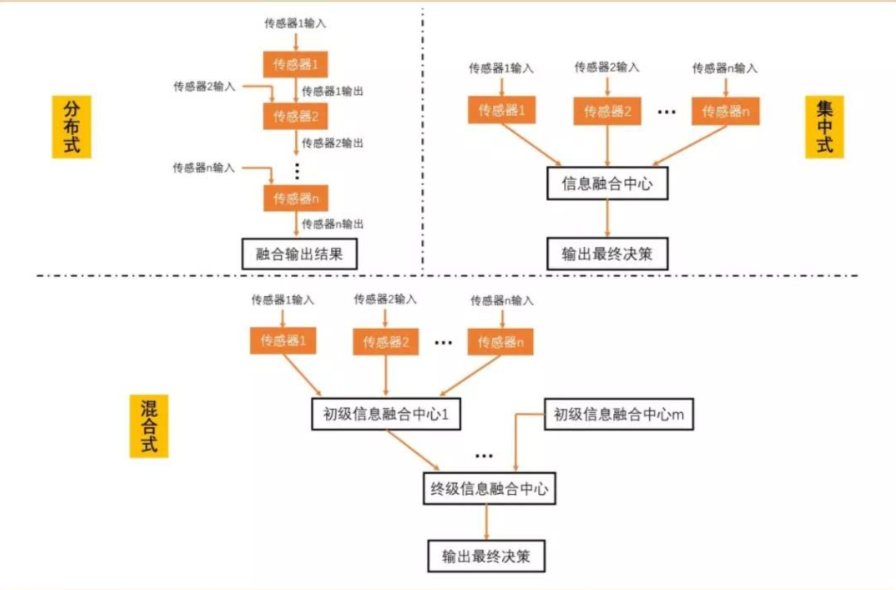

 **多传感器融合的先决条件**

1.统一时钟

主要目的是同步不同传感器的时间戳，保证有一个相同的时间系统；

不同传感器的数据频率是不同的，数据还存在延迟，解决方法：

​    1.可以通过找相邻时间戳的方法找到最近帧

​    2.硬件同步大大降低同步误差，提高数据对齐效果。

2.统一坐标系

统一坐标系有两步，**一是运动补偿，二是传感器标定**。

**运动补偿**主要针对长周期的传感器，如lidar，周期为100ms。由于所有的传感器都装在车上，车是运动的刚体。因此传感器在采集数据时，周期开始的时间点和结束时间点车辆是处于不同位置的，导致不同时刻采集的数据所处坐标系不同，因此需要根据车体的运动对传感器采集的数据进行运动补偿。

**传感器标定**分为内参标定和外参标定，内参标定，解决的是单独的每个传感器与世界坐标系间的变换；外参标定是在世界坐标系下，解决的不同传感器间的变换。传感器外参校准依赖于传感器的精确内参校准。集在一个名字下。本质上

## 3.行业

多传感器融合应用领域比较多的领域有：自动驾驶、机器人、AR/VR、无人飞行器、室内定位等。

### 1.自动驾驶

自动驾驶是涉及多传感器融合比较多的领域，也是比较复杂的领域。

自动驾驶产业链分析：

 [自动驾驶产业链.pdf](自动驾驶产业链.pdf) 

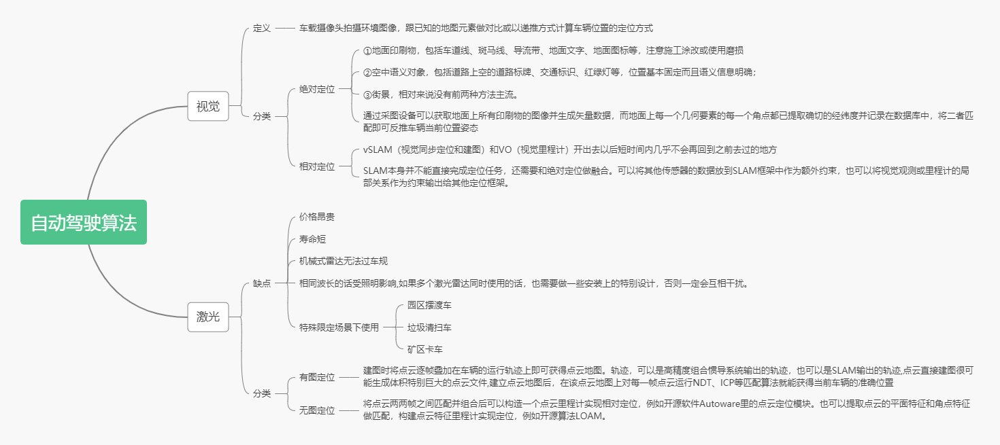

上图是整理的视觉传感器和激光传感器在自动驾驶算法中使用的算法思路。

Appllo 、google和Stanford无人车实验室的定位方案是：GNSS/INS/LiDAR/HDmap融合定位方案，利用实时采集的点云与已有的高精地图点云进行匹配，基本框架都是基于贝叶斯滤波框架，具体方案无法了解，百度有篇论文介绍了LiDAR/camera/HDmap 融合定位的方法。

Stanford 2010论文： [Robust Vehicle Localization in urbanEnvironments using  probabilistic maps.pdf](Robust Vehicle Localization in urbanEnvironments using  probabilistic maps.pdf) 

以特斯拉（Tesla）、Mobileye为首的视觉定位方案：GNSS/INS/camera/HDmap融合定位方案。

### 2.机器人&AGV

####2.1机器人

#### 2.2 AGV简介

AGV为Automated Guided Vehicle的缩写，其装备自动引导装置，在计算机监控下能够沿着规定的导引路径行驶。AGV是轮式移动机器人（WMR-wheel  Mobile Robot）的特殊应用。

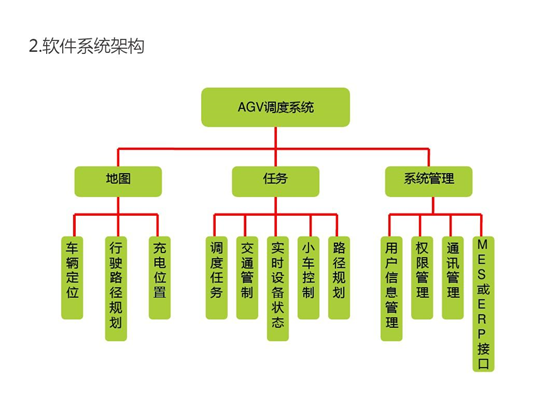

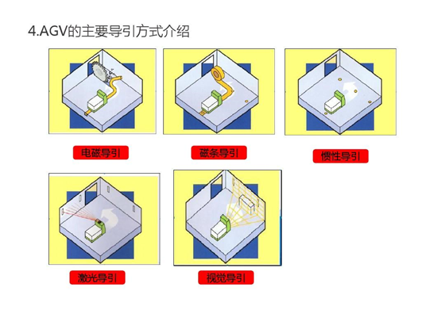

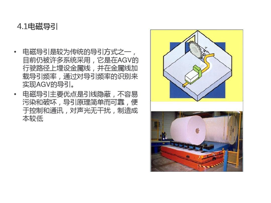

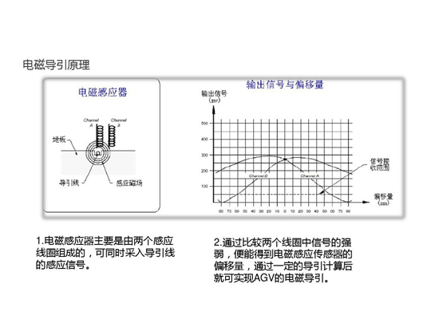

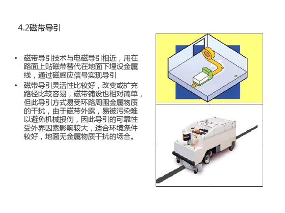

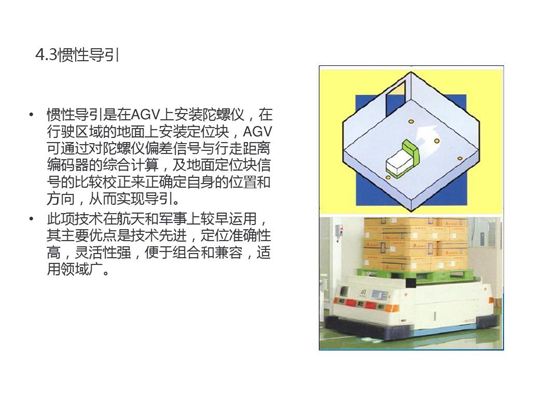

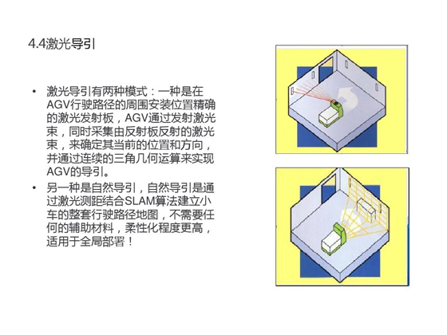

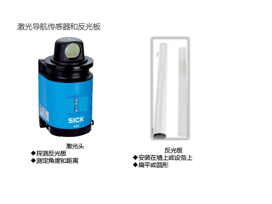

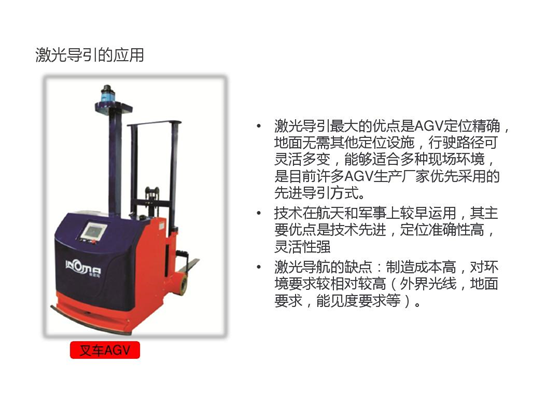

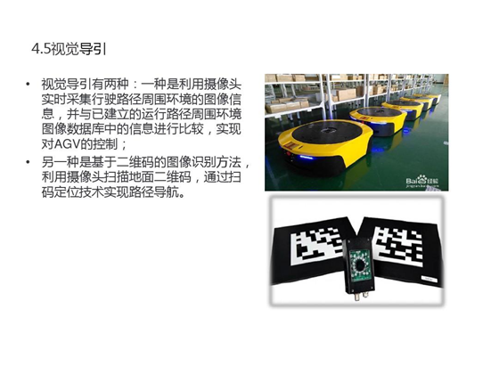

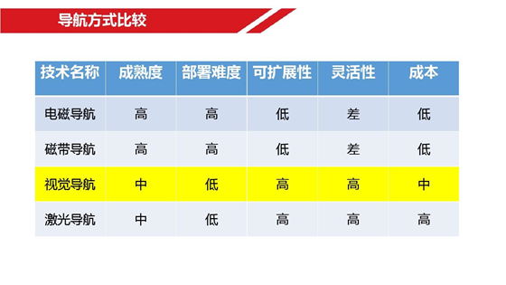

SLAM运用在AGV上，可以不用预先铺设任何轨道，方便工厂生产线的升级改造和导航路线的变更，实时避障，环境适应能力强，更好地实现多AGV小车的协调控制，实现在未知环境中进行自主定位和导航。AGV中多传感器融合其实就是SLAM系统。

AGV中进行环境信息感知的主要传感器有激光雷达、摄像头等。基于激光雷达的AGV小车SLAM，由于其测量精度高探测距离远，且不易受外界环境的干扰，是目前AGV市场上采用的主要方案，而基于视觉的AGV小车SLAM依靠其成本的优势加之人工智能的独特优势，已经成为当前AGV小车的研究热点。

#####2.2.1基于激光雷达的AGV小车SLAM方案

基于激光雷达的AGV小车SLAM方案基于的开源算法：

激光AGV算法:

<video src="D:\多传感器融合\机器人\ROS - Google Cartographer, Hector SLAM and GMapping SLAM.mp4"></video>

主流的激光SLAM算法有hector、gmapping、karto、cartographer。

hector是一种结合了鲁棒性较好的扫描匹方法2D_SLAM方法和使用惯性传感系统的导航技术。传感器的要求较高，高更新频率小测量噪声的激光扫描仪，不需要里程计。使空中无人机与地面小车在不平坦区域运行存在运用的可能性。作者利用现代激光雷达的高更新率和低距离测量噪声，通过扫描匹配实时地对机器人运动进行估计。所以当只有低更新率的激光传感器时，即便测距估计很精确，对该系统都会出现一定的问题。

gmapping是一种基于粒子滤波的激光SLAM算法，它已经集成在ROS中，是移动机器人中使用最多的SLAM算法。基于粒子滤波的算法用许多加权粒子表示路径的后验概率，每个粒子都给出一个重要性因子。但是，它们通常需要大量的粒子才能获得比较好的的结果，从而增加该算法的的计算复杂性。此外，与PF重采样过程相关的粒子退化耗尽问题也降低了算法的准确性。

karto是基于图优化的SLAM算法，用高度优化和非迭代cholesky矩阵进行稀疏系统解耦作为解。图优化方法利用图的均值表示地图，每个节点表示机器人轨迹的一个位置点和传感器测量数据集，箭头的指向的连接表示连续机器人位置点的运动，每个新节点加入，地图就会依据空间中的节点箭头的约束进行计算更新。路标landmark越多,内存需求越大,然而图优化方式相比其他方法在大环境下制图优势更大。

cartographer是google开发的实时室内SLAM项目，cartographer采用基于google自家开发的ceres非线性优化的方法，cartographer的量点在于代码规范与工程化，非常适合于商业应用和再开发。并且cartographer基于submap子图构建全局地图的思想，能有效的避免建图过程中环境中移动物体的干扰。并且cartographer支持多传感器数据（odometry、IMU、LaserScan等）建图，支持2D_SLAM和3D_SLAM建图。

cartographer处理框架

cartographer采用的是主流的SLAM框架，也就是特征提取、闭环检测、后端优化的三段式。由一定数量的LaserScan组成一个submap子图，一系列的submap子图构成了全局地图。用LaserScan构建submap的短时间过程累计误差不大，但是用submap构建全局地图的长时间过程就会存在很大的累计误差，所以需要利用闭环检测来修正这些submap的位置，闭环检测的基本单元是submap，闭环检测采用scan_match策略。cartographer的重点内容就是融合多传感器数据（odometry、IMU、LaserScan等）的submap子图创建以及用于闭环检测的scan_match策略的实现。

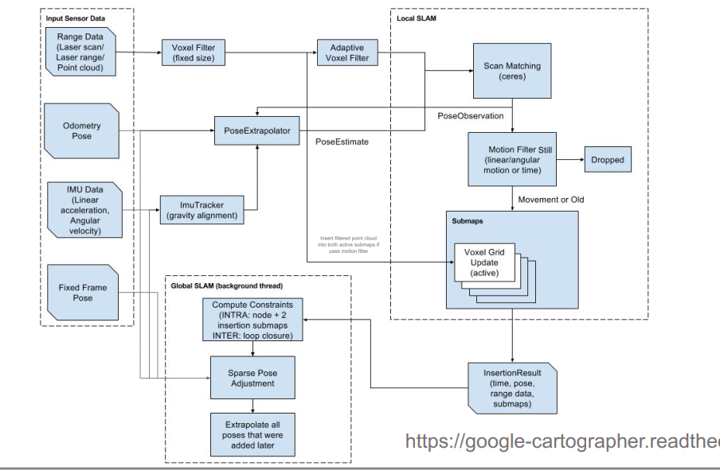

 [20200510-崔佳峰-Cartographer代码讲解cartographer_ros.pdf.pdf](cartographer\20200510-崔佳峰-Cartographer代码讲解cartographer_ros.pdf.pdf)

 [2020.06.28-激光SLAM前端-张涵.pdf](cartographer\2020.06.28-激光SLAM前端-张涵.pdf) 

 [激光SLAM数据预处理-曹秀洁 - 20200524.pdf](cartographer\激光SLAM数据预处理-曹秀洁 - 20200524.pdf) 

 [张涵cartographer论文带读.pdf](cartographer\张涵cartographer论文带读.pdf) 

[Real Time Loop Closure in 2D LIDAR SLAM.pdf](cartographer\Real Time Loop Closure in 2D LIDAR SLAM.pdf) 

#####2.2.2基于视觉的AGV小车SLAM方案

基于视觉的AGV小车SLAM技术方案各个AGV厂商都处于研究阶段，各家方案并没有详细资料，目前搜到的资料只有一家马路创新的公司宣称基于视觉SLAM AGV小车落地 。

视觉SLAM的方案大都基于开源的视觉SLAM算法，如下是网上搜到整理的开源方案：

[视觉开源SLAM代码.pdf](视觉开源SLAM代码.pdf) 

1.msckf --滤波框架（rovio也是采用的滤波框架）

MSCKF的目标是解决EKF-SLAM的维数爆炸问题。传统EKF-SLAM将特征点加入到状态向量中与IMU状态一起估计，当环境很大时，特征点会非常多，状态向量维数会变得非常大。MSCKF不是将特征点加入到状态向量，而是将不同时刻的相机位姿(位置 ![[公式]](https://www.zhihu.com/equation?tex=p)和姿态四元数 ![[公式]](https://www.zhihu.com/equation?tex=q))加入到状态向量，特征点会被多个相机看到，从而在多个相机状态（Multi-State）之间形成几何约束（Constraint），进而利用几何约束构建观测模型对EKF进行update。由于相机位姿的个数会远小于特征点的个数，MSCKF状态向量的维度相较EKF-SLAM大大降低，历史的相机状态会不断移除，只维持固定个数的的相机位姿（Sliding Window），从而对MSCKF后端的计算量进行限定。

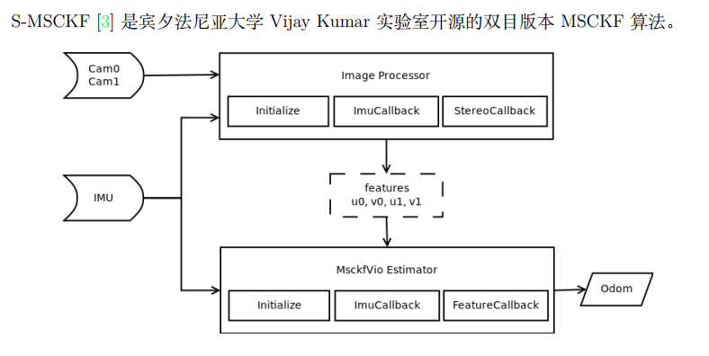

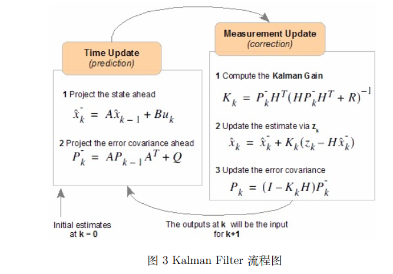

 [msckf_note_cg.pdf](msckf_note_cg.pdf) 

http://www.xinliang-zhong.vip/msckf_notes/  

https://zhuanlan.zhihu.com/p/76341809

2.okvis 2.0 优化框架

 [smart-robotics-lab.pdf](smart-robotics-lab.pdf) 

轮速计的工作原理

根据安装在双轮差动机器人左右两个驱动轮电机上的广电编码器，来检测车轮在一定时间内移动的距离，从而推算出机器人相对位姿（位置和航向）的变化

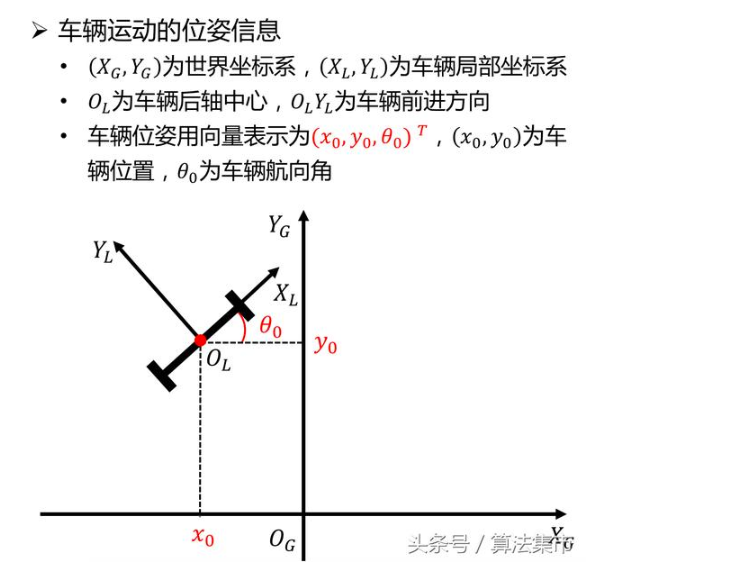

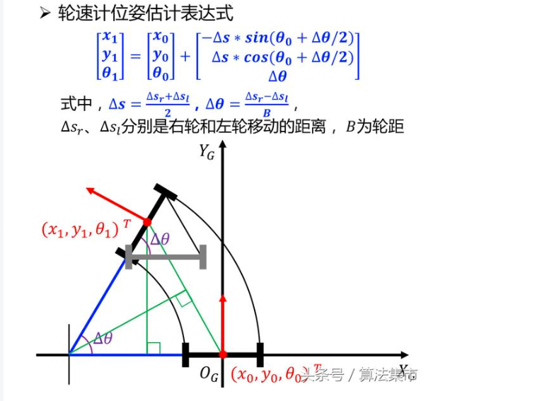

[轮速仪的建模]([https://blog.csdn.net/KYJL888/article/details/100515455?biz_id=102&utm_term=%E8%BD%AE%E9%80%9F%E8%AE%A1%E7%9A%84%E5%BB%BA%E6%A8%A1%E4%B8%8E%E7%B2%BE%E5%BA%A6%E8%AF%84%E4%BC%B0&utm_medium=distribute.pc_search_result.none-task-blog-2~blog~sobaiduweb~default-1-100515455&spm=1018.2118.3001.4187](https://blog.csdn.net/KYJL888/article/details/100515455?biz_id=102&utm_term=轮速计的建模与精度评估&utm_medium=distribute.pc_search_result.none-task-blog-2~blog~sobaiduweb~default-1-100515455&spm=1018.2118.3001.4187))

## Visual-Inertial Odometry Tightly Coupled with wheel Encoder Adopting  Robust Initialization and online Extrinsic Calibration

摘要

对于汽车定位由于价格低廉并且优势互补,将相机 IMU 和轮速编码器融合是一个比较明智方案.从以上的传感器组合中我们提出了一个可扩展的视觉惯性里程计算法方案.首先我们提出了一个IMU-里程计预积分方案,利用IMU测量数据和轮速编码器读数,从而是尺度估计更加精确. 其次, 我们开发了一个原生的初始化模块,该模块充分利用编码器数据来精化重力方向,并且提供真实尺度下的相机位姿的初始值.再次,我们设计了一个高效的外参在线标定方法通过固定IMU-odometry外参参数旋转部分的线性化点

由于轮式机器人基本上都是在平面上运动的，这就会导致vio系统不可观的自由度增加，比如说尺度。为了解决这一问题，就引用了编码器，编码器的引用会解决这些问题[1]，所以呢，在轮式机器人上编码器和VIO的融合也成为了一个研究的方向。

该篇文章主要是做了三点的工作：（1）IMU与Odometry的预积分，（2）Odometry的引用之后的初始化过程，主要是为了修正重力方向和给相机位姿一个真实的尺度，（3）线上的外参标定。

### 坐标系的定义

这里用到了IMU、相机和轮速计，所以一共需要4个坐标系，IMU坐标系，相机坐标系，轮速计坐标系以及世界坐标系，论文中使用下图进行表示。除了世界坐标系，相机和轮速计都是通过IMU来进行转化的，所以需要标定IMU和相机，轮速计和IMU之间的外参。

坐标系之间的关系

### 预积分阶段

该预积分的IMU部分与vins-mono的论文中写的是一样的，区别就是多了一项编码器部分，假设轮速传感器只安装在单轮上，比如左后轮。在VINS的预积分的基础上进行扩展，使用陀螺和编码器的读数构建编码器的预积分方程。这里的公式为

预积分的公式

这是在第k和第k+1帧图像之间的积分， ![[公式]](https://www.zhihu.com/equation?tex=%5Calpha%2C%5Cbeta%2C%5Cgamma) 为IMU坐标系下的位置，速度和角度，与vins无异就不做解释了。第四项 ![[公式]](https://www.zhihu.com/equation?tex=%5Ceta) 就是增加的一项表示在IMU坐标系下，Odometry运行的位置， ![[公式]](https://www.zhihu.com/equation?tex=%5Chat+v%5Ei_l+) 表示的是轮速计的速度读数，一般为 ![[公式]](https://www.zhihu.com/equation?tex=%5Bv_x%2Cv_y%2C0%5D%5ET) ，将它乘以时间就是在odometry坐标系下的位置，通过IMU和Odometry之间的外参，以及IMU得到的旋转角，就可以得到在IMU坐标系下的轮速计所运动的距离。从上述的公式也可以看出，IMU与轮速计之间的频率是一样的。

协方差的推导如下：

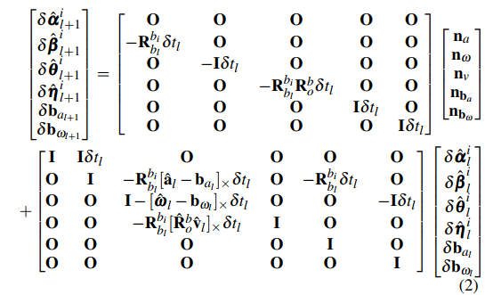

积分的过程肯定是存在误差和噪声的传播，这里就需要通过协方差来进行传递，就需要计算后一时刻对前一时刻的雅克比A，以及后一时刻对噪声的雅克比B，通过下面的公式进行协方差的传递

协方差的传递

**总结**：以上的过程可以参考vins-mono的预积分过程，形式差不多就是多了一个参数而已。

### 初始化阶段

初始化过程主要是为了优化IMU的角速度偏置，重力方向，以及根据轮速计得到尺度信息。不像无人机可以自由的在天空翱翔，轮式机器的运动是有局限性的，这也是他在初始化阶段会由于激励不够导致初始化失败的原因。所以该篇文章在这个部分也对vins-mono进行了一定的修改。

1、对于角速度的偏置计算需要最小化的函数为

![[公式]](https://www.zhihu.com/equation?tex=%5Cmin_%7Bb_w%7D%5Cleft%7C+%5Cleft%7C++2%5B%5Chat%7B%28%5Cgamma%5E%7Bb_k%7D_%7Bb_%7Bk%2B1%7D%7D%7D%29%5E%7B-1%7D%5Cotimes+q%5Eb_c+%5Cotimes+q%5E%7Bc_k%7D_%7Bc_%7Bk%2B1%7D%7D%5Cotimes+q%5Ec_b%5D_%7Bvec%7D++%5Cright%7C+%5Cright%7C+%5E2) 

预积分已经得到了旋转对角速度偏置的雅克比，误差也已知，这样就可以得到角速度偏置。

2、重力方向的优化

在vins中优化的是相机坐标系下的重力，而该篇文章中优化的在IMU坐标系下的重力，IMU的位置与里程计的位置之间的转化关系为下面公式(1)，其中o为Odometry的坐标系， ![[公式]](https://www.zhihu.com/equation?tex=b_0) 表示的是和主帧相机时间对齐的IMU帧

![[公式]](https://www.zhihu.com/equation?tex=p%5E%7Bb_0%7D_%7Bb_k%7D%3Dp%5E%7Bb_0%7D_%7Bo_k%7D-R%5E%7Bb_0%7D_%7Bb_k%7Dp%5Eb_o++%5Ctag+%7B1%7D) 

根据预积分并且将世界坐标系转换为 ![[公式]](https://www.zhihu.com/equation?tex=b_0) 坐标系，可以得到

![[公式]](https://www.zhihu.com/equation?tex=%5Calpha%5E%7Bb_k%7D_%7Bb_%7Bk%2B1%7D%7D%3DR%5E%7Bb_k%7D_%7Bb_0%7D%28p%5E%7Bb_0%7D_%7Bb_%7Bk%2B1%7D%7D-p%5E%7Bb_0%7D_%7Bb_k%7D-R%5E%7Bb_0%7D_%7Bb_%7Bk%7D%7Dv%5E%7Bb_k%7D_k%5CDelta+t+%2B+%5Cfrac%7B1%7D%7B2%7Dg%5E%7Bb_0%7D%5CDelta+t%29+%5C%5C+%5Cbeta%5E%7Bb_k%7D_%7Bb_%7Bk%2B1%7D%7D+%3D+R%5E%7Bb_k%7D_%7Bb_0%7D%28R%5E%7Bb_0%7D_%7Bb_%7Bk%2B1%7D%7Dv%5E%7Bb_%7Bk%2B1%7D%7D_%7Bk%2B1%7D-R%5E%7Bb_0%7D_%7Bb_%7Bk%7D%7Dv%5E%7Bb_%7Bk%7D%7D_%7Bk%7D%2Bg%5E%7Bc_0%7D%5CDelta+t%29+%5Ctag%7B2%7D) 

VINS常速度初始化面临的问题可以添加里程计来解决，方法：

使用视觉来求两关键帧之间的旋转，从而求出陀螺的零偏。

将（1）式带入（2）式，并且对重力加速度进行施密特正交化，最后就可以得到论文中的公式

优化重力：

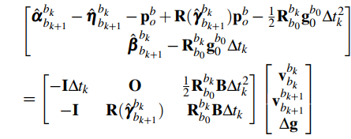

重力优化公式

其中 ![[公式]](https://www.zhihu.com/equation?tex=%5Cmathbf%7Bg%7D%5E%7Bb_0%7D_0%3D%5Cmathbf%7BR%7D%5Eb_o%5Cbegin%7Bbmatrix%7D+0+%26+0+%26+g+%5Cend%7Bbmatrix%7D%5ET) ，g是重力的幅度，将其进行施密特正交化，就会得到令两维的方向，优化的时候只要优化这两维的幅度就可以了。另两维的表示为 ![[公式]](https://www.zhihu.com/equation?tex=%5Cmathbf%7BB%7D) ，得到 ![[公式]](https://www.zhihu.com/equation?tex=%5Cmathbf%7Bg%7D%5E%7Bb_0%7D%3D%5Cmathbf%7Bg%7D%5E%7Bb_0%7D_0%2B%5Cmathbf%7BB%7D%5CDelta+%5Cmathbf%7Bg%7D) 。这样得到IMU坐标系下的重力就可以得到IMU与世界坐标系之间的关系，就能让IMU与世界坐标对齐了，也让IMU与Odometry之间对齐。

对于相机的位姿，文章中使用的是航迹推算，这里文章中没有细说，我的理解应该是相机的位姿使用的就是里程计的位姿，通过里程计与相机之间的外参就能得到相机的位姿了。

3、非线性优化

需要优化的变量如下所示

优化变量

K表示滑窗内的关键帧个数。

优化的目标为

优化目标函数

![[公式]](https://www.zhihu.com/equation?tex=e_r) 为重投影误差形式和雅克比与vins相同， ![[公式]](https://www.zhihu.com/equation?tex=e_m) 为先验误差也和vins一样， ![[公式]](https://www.zhihu.com/equation?tex=e_s) 为IMU和Odometry的误差，形式如下表示

里程计的误差主要有陀螺仪的误差和白噪声引起，残差方程：

IMU和编码器误差

这里就是多了第4项，它的误差可以通过（1）式得到，优化是通过ceres的Dogleg进行的。初始的时候外参是固定的，加速度偏置收敛的时候才进行优化。

### 外参优化

文中写的是线上外参标定，我觉得这应该算是一个外参优化，因为在初始化阶段需要知道外参。

在这一部分提出了一个理论就是如果要进行外参优化，必须等到加速度偏置是否收敛。使用该项准则的原因如下图所示

可以看到绿线，在初始化后进行外参优化会很不稳定。造成这样的原因是认为其他参数没有很好的进行约束，这里就提出了一个加速度偏置。确实在初始化之后，加速度偏置也是没有进行优化的。文中就引出了一个等加速度偏置收敛了再进行外参的优化，如何判断加速度是否收敛，文中用实验结果发现车转弯超过45度之后，角速度的偏置会在后面趋向于一个稳定值。判断依据是两个连续估计的加速度偏置在20s之内小于下面的阈值

加速度偏置幅度的阈值

![[公式]](https://www.zhihu.com/equation?tex=%5Csigma_%7Bb_a%7D) 为加速度偏置白噪声的标准差， ![[公式]](https://www.zhihu.com/equation?tex=%5CDelta+t) 表示每两个连续估计加速度之间的平均时间。雅克比的计算可以见论文。

## Tightly-coupled Monocular visual-odometric SLAM using wheels and a MEMS Gyroscope---陀螺仪+轮速计+单目视觉融合

### 摘要

本文我们使用轮速计 MEMS 陀螺提出了一个新颖的单目SLAM,可以为平面移动的地上机器人提供精确的鲁棒的长期运行的定位.

1、提出一种预积分理论，将轮编码器和陀螺仪测量结果整合到局部框架里。预积分解决了旋转群SO(3)的流形结构。并讨论了不确定性传播和偏差校正。
 2、里程计的误差项由预积分模型设计，紧融合在视觉优化框架
 3、三种情况下鲁棒性：两种测量都可用；视觉测量失效；车轮编码器滑移

该论文的源代码是在ORBslam的基础上修改实现的.

 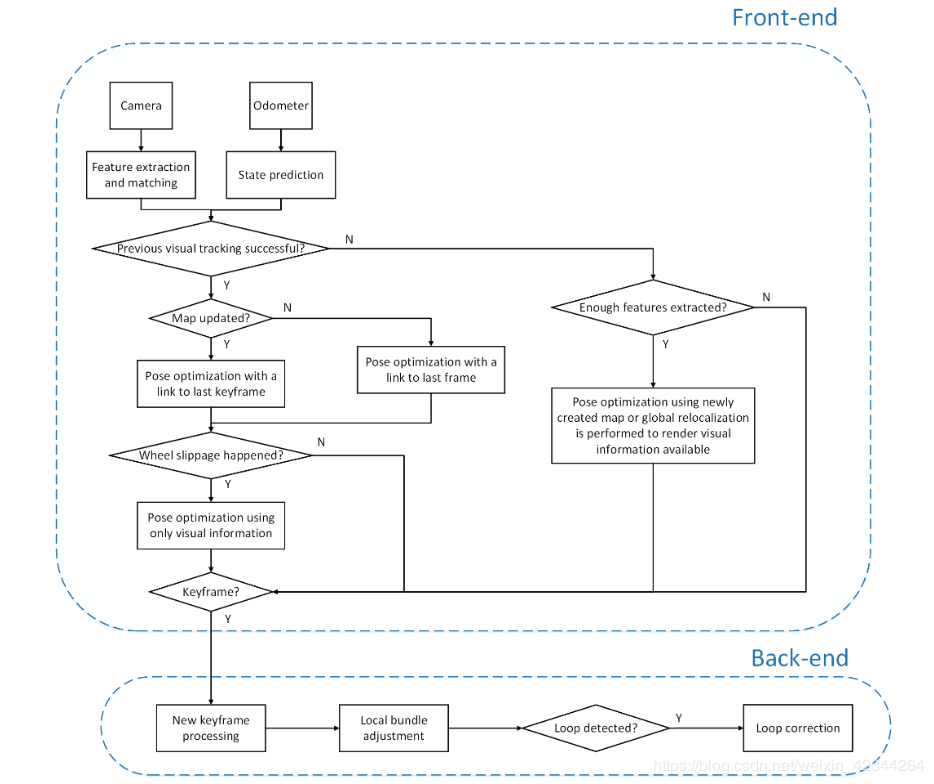

### 单目SLAM相关工作：

- 第一个实时单目视觉SLAM ，**MonoSLAM**是基于EKF的方法，在滤波中计算雅可比矩阵方法导致系统具有不正确的可观性，因此系统不一致且精度低；为了解决这个问题，黄国权等人提出first-estimates Jacobian 方法，他利用第一个可用的估计而不是不同的线性化点来计算雅可比，来保证系统的正确可观性，从而提高系统的一致性和准确性。J. A Hesch等人提出可观测性约束的EKF，明确强制实施系统的不可观测方向，从而提高系统的一致性和准确性。
- 另一方面，基于非线性优化的方法精度更高，因为它能够在每次迭代时重新线性化测量模型，以更好的处理非线性化，但是计算成本高。第一个基于实时优化的单目视觉SLAM系统是由Klein和Murray提出的**PTAM**。PTAM分两个线程，一个线程中，系统对选定的关键帧和构造的地图点进行BA，另一个线程通过最小化特征点与匹配地图点的重投影误差来优化相机位姿。
- 基于PTAM改进为**ORB-SLAM2**。以上是特征点法。估计准确，但计算耗资源，且对弱纹理环境低鲁棒性。
- 直接法是根据光强，在低纹理环境中以及在相机散焦和运动模糊的情况下优于特征点法。比如**DTAM、SVO、LSD-SLAM**是单目直接法。
- 基于滤波最好的VIO是**MSCKF**，它利用视觉测量提供的所有可用的几何信息，计算复杂度仅在特征点数量上呈线性，通过剔除在状态向量中的点特征实现。
- **OKVIS**基于图优化框架紧融合VI测量，由于在该系统下，当线性化点改变时，重复计算IMU积分，为了消除这种计算。Forster等人提出IMU预积分理论，以全概率的方法将IMU预积分因子和视觉因子紧耦合在一起。
- 后来提出的**ORB-VISLAM**有闭环，鲁棒性和精度更高。后来还有**VINS_mono、VINS_Fuision**
- 后来有人提出*VINS系统融合里程计*，提供系统可观测的尺度。

### 算法详解前基本说明：

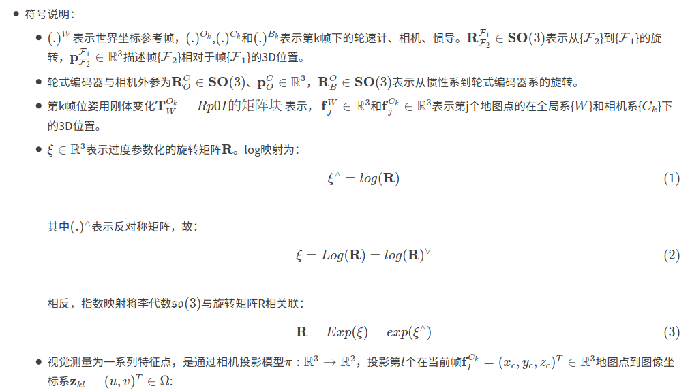 

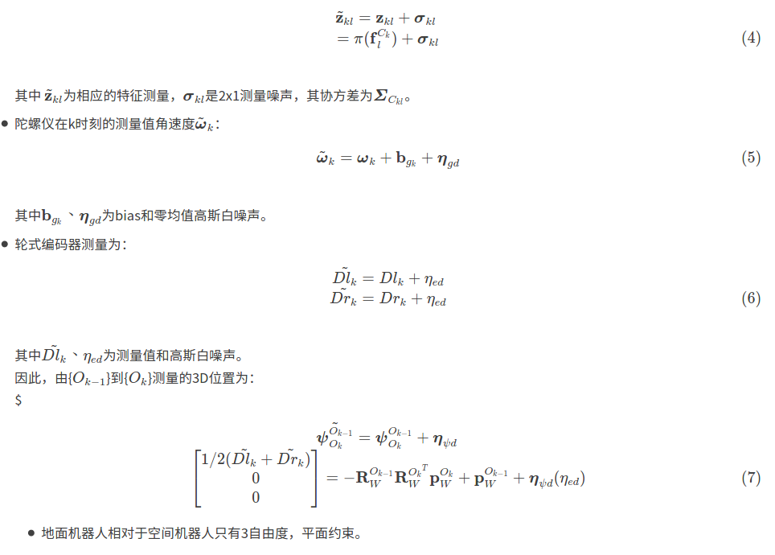

其中公式(7)表示的是$O_k$相对于世界坐标系的坐标转化到$O_{k-1}$相对世界坐标系的坐标,与实际上$O_{k-1}$相对世界坐标系的坐标之差,是里程计移动的距离.**等号左边存疑**

### 紧耦合非线性优化

里程计-陀螺预积分公式

假设k时刻陀螺零偏已知,推导出预积分公式:
$$
\Delta R = \prod_{k=i}^{j - 1}R^O_B Exp((\widetilde{\omega} -b_{g_i} - \eta_{gd})\Delta t){R^O_B}^T
$$

$$
\Delta P_{ij} =  \sum_{k=i+1}^{j} \Delta R_{ik-1} (\widetilde{\psi}^{O_{k-1}}_{O_k} - \eta_{\psi d})
$$

1. 可以将$\Delta R$和$\Delta P_{ij}$表示为噪声的形式,用以进行协方差的传播.

2. 将$\Delta R$和$\Delta P_{ij}$表示为零偏的扰动,为计算残差求偏导数做准备.

   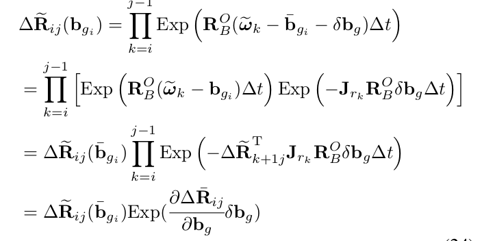

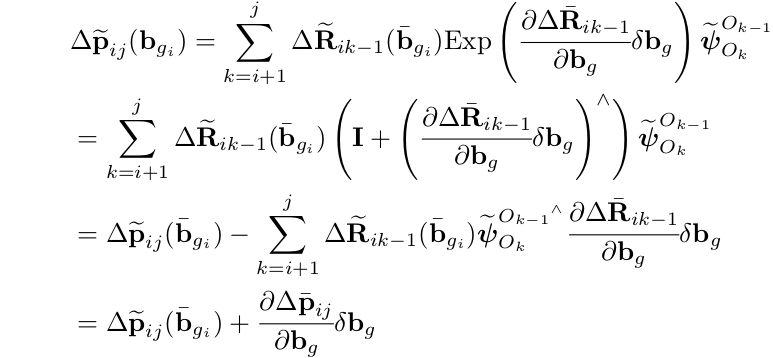

3. 计算残差

   

   

   

A Map初始化：

初始化由视觉和里程计构建地图点的初始集。1、在当前帧k检测ORB特征点并且与参考帧r进行特征点匹配，如果有足够的匹配点则执行下一步，否则将当前帧设置为参考帧；2、检查视差，并且选出一组具有足够视差的特征匹配，当大于阈值是，使用里程计测量值计算两帧之间的相对变换，并对匹配的特征点进行三角测量；3、如果成功创建的地图点的大小大于threadshold，则对重投影误差、里程计误差和平面误差执行全局BA来优化初始地图。

B 跟踪之前成功的视觉跟踪

一旦里程计预测当前帧的初始位姿，则将局部地图中的地图点投影到当前帧并与从当前帧提取的关键点进行匹配。然后通过最小化能量函数来优化当前帧的位姿。判断后端中的地图是否被更新，位姿预测和优化方法不同。并且提供了一种解决轮子滑移的情况，

**1**、当地图更新时的Tracking：在后端地图更新之后立即执行跟踪时，首先计算当前帧和之前关键帧m之前的里程计预积分值。然后，计算出相对变化 $ T_{O_k}^{O_m}$与优化的last关键帧结合（怎么结合？）以预测当前帧的初始位姿。这么做的是因为在后端执行局部或全局BA后，上一关键帧的位姿足够精确。最后，通过最小化下列能量函数来优化当前帧的状态：
 

**2**、当地图没有更新时的Tracking：当后端中的地图未发生变化时，只计算当前帧k与上一帧k-1之间的预积分测量值，并通过将相对变换 $T_(O_k)^(O_(k-1))$整合（*怎么整合？*）到上一帧的位姿来预测当前帧的初始位姿。然后，通过最小化以下目标函数来优化当前帧的位姿：

 其中残差项$r_{0_{k−1}}={r^T_{R_{k−1}},r^T_p{_{k−1}},r^T_b{_{k−1}}}∈ℝ^9$是上一帧的先验误差：

**3**、  检测并解决车轮滑移：如果上述优化使一半的原始匹配点为异常值，则认为当前帧k经历一次滑移。一旦检测到车轮打滑，将滑点标志设置为当前帧并重置当前帧初始位姿，即上一帧k-1的位姿。然后在局部地图中重新投影地图点，并与当前帧的特征点重新匹配。最后，仅通过那些匹配的特征点来优化当前帧的状态：
优化之后，当前帧的结果估计和Hessian矩阵被用作下一次估计的先验。

**C**、当视觉跟踪丢失：

假设之前视觉跟踪丢失，则当前帧会发生以下三种情况:1)机器人访问已重建的区域  ；2)机器人访问新的可以建立足够地图点的环境；3)机器人依然无法获得视觉特征。对于情况1)，执行全局重定位，使用DBoW和PnP来计算当前帧位姿。对于2)，首先使用里程计来预测当前帧的初始位姿，然后将上一帧看到的地图点投影到当前帧并使用这些匹配的特诊点优化当前帧位姿。对于情况3)，使用里程计来计算当前帧的位姿。

当视觉跟踪丢失后从当前帧提取足够的特征时，首先认为机器人可能返回已经重建的环境，因此执行全局重定位（情况1）。然后，如果重定位连续失败，直到选择具有足够特征的第二个关键帧来重建地图，则认为机器人进入新环境。当足够匹配的特征点支持相机位姿是，则认为视觉信息可用于当前帧的跟踪（情况2）。

**D**、关键帧的策略

如果视觉跟踪成功，两个关键帧选择标准，1)当前帧跟踪的特征点比上一关键帧少50%；  2)局部BA完成后加入关键帧。满足以上条件尽可能多的插入关键帧；如果视觉跟踪丢失，满足下列条件之一时将关键帧插入后端，1)距离上一关键帧的traveled 距离大于某一阈值，2)距离上一关键帧的相对旋转角度超过阈值，3)局部BA在局部mapping线程中完成。

**E**、后端：

包括局部mapping和局部回环线程。局部mapping线程旨在构建环境的新地图点，并且优化局部地图。如果新的关键帧k的视觉跟踪丢失，我们通过为关键帧k添加一个新节点和与上一关键帧连接的边缘来更新图模型，以确保能够构建新的map。此外，视觉-里程计局部BA优化之前N个关键帧（局部window）和这些关键帧所看到的所有点，通过最小化窗口中的损失函数(12)实现。注意，链接到上一关键帧的里程计约束仅为那些没有滑点标志的关键帧。回环线程负责回环时消除累计漂移。

## VINS on Wheels

### 摘要

本文发表了用于轮式机器人定位的视觉辅助惯性导航系统,我们证明了VINS还有额外的不可观方向:当VINS部署在地面运动机器人,尤其是运动只有直线或者圆弧的时候尺度就会变得不可观.为了打破这种限制,引入低频的轮式编码器数据来扩展VINS系统,使得尺度变得可观.另外,为了提高定位精度,我们引入流行并利用机器人在近似平面上运动的特点.

对于原本的vins系统，只有4个不可观的方向（位置和yaw角），但是对于在平面运动的vins系统，随着运动模式的不同，不可观性的自由度会增加。本文提出并证明了在两种状况下vins的自由度增加的结果，证明过程也可以参考论文[Unobservable Directions of VINS Under Special Motions](https://pdfs.semanticscholar.org/4947/d28474cddd5cba7f592a8d3dcfd63316c02e.pdf)。

匀加速运动会导致尺度的不可观，没有旋转的运动会导致除yaw角之外，roll和pitch角也会不可观。如果机器人有上述的运动的话，会导致通过vins得到的信息矩阵成为病态矩阵，甚至是是不满秩，因此会退化定位的结果。

为了提高VINS应用于地上机器人的性能,解决上述的问题，本文将vins与轮速计进行融合。**可以使用两方面的附加信息:1.里程计(轮速编码器)信息2.平面运动的限制.**

### vins加上双轮里程计

大多数的地面车辆都配备了轮式编码器，可以提供每个车轮的运动信息，这些信息经常是伴有噪声的，低频的，可能只有间歇性的可靠测量。另一方面，这些信息包含了在匀加速情况下必要的尺度信息。利用Odometer的内参，可以得到轮式编码器的2D线速度和角速度，公式如下:

![[公式]](https://www.zhihu.com/equation?tex=v%3D%5Cfrac%7Br_lw_l%2Br_rw_r%7D%7B2%7D%2Cw%3D%5Cfrac%7Br_rw_r-r_lw_l%7D%7Ba%7D++%5Ctag%7B1%7D) 

其中， ![[公式]](https://www.zhihu.com/equation?tex=w_l%2Cw_r) 分别为左轮和右轮的旋转速度， ![[公式]](https://www.zhihu.com/equation?tex=r_l%2Cr_r) 为左轮和游轮的半径，a为左轮和右轮之间的距离。该过程为航迹推演，可以参考[博客](https://blog.csdn.net/heyijia0327/article/details/47021861)。

里程计的线速度测量结果包含了绝对尺度信息。轮式编码器线性速度测量包含绝对的尺度信息,因此,轮速传感器的不仅提高了vins的定位精度，而且在vins尺度不可观的情况下提供了尺度信息。

### vins耦合里程计信息

本文中，Odometer的数据是通过对线速度和角速度的积分来与vins进行融合的。

**假设在两个连续的里程计读数之间车辆是在平面上运动的，基线和车轮半径假设精确已知**.那么在角度上只有绕z轴方向有变化（yaw角）$^{O_k}\phi_{O_{k+1}}$(根据双轮里程计计算)，其他的角度变化为0，所以在里程计坐标系下 ![[公式]](https://www.zhihu.com/equation?tex=%5C%7B+O_k%5C%7D) 和 ![[公式]](https://www.zhihu.com/equation?tex=%5C%7B++O_%7Bk%2B1%7D++%5C%7D) 之间，旋转的变化为（表示绕z轴旋转之后的旋转矩阵）

![[公式]](https://www.zhihu.com/equation?tex=%7B%7D%5E%7BO_k%7D_%7BO_%7Bk%2B1%7D%7D+%5Cmathbf%7BC%7D%3D+%5Cmathbf%7BC%7D_z%28%7B%7D%5E%7BO_k%7D%5Cphi+_%7BO_%7Bk%2B1%7D%7D%29+%5Ctag%7B2%7D) 

根据里程计得到的线速度和角速度的积分结果为角度和位置

![[公式]](https://www.zhihu.com/equation?tex=%5Cphi+_k%3D%7B%7D%5E%7BO_k%7D%5Cphi+_%7BO_%7Bk%2B1%7D%7D%2Bn_%7B%5Cphi%7D++++%5Ctag%7B3%7D) 

![[公式]](https://www.zhihu.com/equation?tex=%5Cmathbf%7Bd%7D_k%3D%5CLambda%7B%7D%5E%7BO_k%7D%5Cmathbf%7Bp%7D_%7BO_%7Bk%2B1%7D%7D%2B%5Cmathbf%7Bn%7D_d++%5Ctag%7B4%7D) 

其中 ![[公式]](https://www.zhihu.com/equation?tex=%5CLambda%3D%5B%5Cmathbf%7Be%7D_1+%5Cquad+%5Cmathbf%7Be%7D_2%5D%5ET%EF%BC%8C%5Cmathbf%7Be%7D_1%3D%5B1+%5Cquad+0+%5Cquad+0%5D%5ET%EF%BC%8C%5Cmathbf%7Be%7D_2%3D%5B0+%5Cquad+1+%5Cquad+0%5D%5ET) ， ![[公式]](https://www.zhihu.com/equation?tex=%5Bn_%7B%5Cphi%7D+%5Cquad+%5Cmathbf%7Bn%7D%5ET_d%5D%5ET) 是3*1维的高斯噪声向量。

![[公式]](https://www.zhihu.com/equation?tex=%7B%7D%5E%7BO_k%7D_%7BO_%7Bk%2B1%7D%7D+%5Cmathbf%7BC%7D%3D%7B%7D%5EO_I%5Cmathbf%7BC%7D+%7B%7D%5E%7BI_k%7D_G%5Cmathbf%7BC%7D+%7B%7D%5E%7BI_%7Bk%2B1%7D%7D_G%5Cmathbf%7BC%7D%5ET%7B%7D%5EO_I%5Cmathbf%7BC%7D%5ET++%5Ctag%7B5%7D+) 

![[公式]](https://www.zhihu.com/equation?tex=%7B%7D%5E%7BO_k%7D%5Cmathbf%7Bp%7D_%7BO_%7Bk%2B1%7D%7D+%3D%7B%7D%5EO%5Cmathbf%7Bp%7D_I%2B%7B%7D%5EO_I%5Cmathbf%7BC%7D+%7B%7D%5E%7BI_k%7D_G%5Cmathbf%7BC%7D+%28%7B%7D%5EG%5Cmathbf%7Bp%7D_%7BI_%7Bk%2B1%7D%7D+-%7B%7D%5EG%5Cmathbf%7Bp%7D_%7BI_%7Bk%7D%7D-+%7B%7D%5E%7BI_%7Bk%2B1%7D%7D_G%5Cmathbf%7BC%7D%5ET+%7B%7D%5EO_I%5Cmathbf%7BC%7D%5ET%7B%7D%5EO%5Cmathbf%7Bp%7D_I%29+%5Ctag%7B+6%7D) 

O和I之间的外参为旋转 ![[公式]](https://www.zhihu.com/equation?tex=%7B%7D%5EO_I%5Cmathbf%7BC%7D) 和平移 ![[公式]](https://www.zhihu.com/equation?tex=%7B%7D%5EO%5Cmathbf%7Bp%7D_I) 。

**其中$^{I_k}_GC$应该是VINS输出的IMU与全局之间的旋转矩阵,根据里程计和IMU之间的几何约束，可以通过IMU与里程计之间的外参得到通过IMU测量结果得到的里程计坐标系下的位置和旋转。**

公式(5)计算的是VINS在全局下两个旋转矩阵转换到里程计坐标系下的旋转矩阵

公式(6)计算的是VINS中IMU两个时刻的坐标在里程计下坐标的坐标

1、旋转的约束

得到里程计的测量角度，和通过IMU获取的角度，就可以知道他们两者之间的误差为

其中 ![[公式]](https://www.zhihu.com/equation?tex=%5Chat%7BC%7D) 表示的是旋转矩阵的估计值， ![[公式]](https://www.zhihu.com/equation?tex=%5Cdelta+%5Ctheta) 表示对应四元数的参数误差， ![[公式]](https://www.zhihu.com/equation?tex=%5Cdelta+%5Cphi) 表示的是测量值和估计值之间的角度误差， ![[公式]](https://www.zhihu.com/equation?tex=%5Clfloor+%5Crfloor) 表示的是反对称矩阵。两边同乘以e3向量之后就可以得到雅克比矩阵和残差

2、平移的约束

将公式（6）带入到公式（4）中就可以得到雅克比和残差

### vins的平面约束

由于轮式机器人在平面运动的特殊性，所以可以加上一个平面运动约束。文中提到了两种约束，一个是确定性约束，另一个是随机约束。

1、确定性约束

在原本的损失函数上加上一个运动流行约束，表达形式为

最小化损失函数的情况下，使得g(x)=0。

以确定性约束为例，表示平面运动的约束。对于平面约束来说，roll和pitch的角度应该为0，在z轴方向的运动也应该为0。在本文添加了一个虚拟平面 ![[公式]](https://www.zhihu.com/equation?tex=%5C%7B+%5Cpi+%5C%7D) ，也就是平面，这里的几何约束如下图所示

坐标系之间的转换图

观察上图，本文需要约束的变量为 ![[公式]](https://www.zhihu.com/equation?tex=%5C%7B+G%5C%7D) 和 ![[公式]](https://www.zhihu.com/equation?tex=%5C%7B+%5Cpi+%5C%7D) 之间的旋转为平移。旋转主要约束的是roll和pitch，所以只要两个自由度，误差为 ![[公式]](https://www.zhihu.com/equation?tex=%5Cdelta+%5Cmathbf%7Bq%7D%3D%5B%5Cfrac%7B1%7D%7B2%7D%5Cdelta+%5Cmathbf%7B%5Ctheta%7D_%7B%5Cpi%7D+%5Cquad+0+%5Cquad+1%5D%5ET) , ![[公式]](https://www.zhihu.com/equation?tex=%5Cdelta+%5Cmathbf%7B%5Ctheta%7D_%7B%5Cpi%7D) 为2*1的向量。位移只需要优化平面和全局坐标系之间的垂直距离。最后的几何约束用下面的公式表示

第一项的约束表示在第k时刻的里程计坐标和平面之间的坐标的roll和pitch角应该为0, ![[公式]](https://www.zhihu.com/equation?tex=%5Cmathbf%7Be%7D_3%3D%5B0+%5Cquad+0+%5Cquad+1%5D%5ET) 表示观测值（理想值）。第二项表示在第k时刻，在平面坐标系下的全局到里程计坐标系之间的垂直距离应该等于全局坐标系到平面坐标系之间的垂直距离。该模型的雅克比为

2、随机约束

在平面上的约束就不是0，而是一个服从0均值的高斯分布，R是协方差

该优化可以与损失函数一起优化，而且该模型胡剔除更多的外点，也就会更稳定，在之后的实验中，这个办法也是比确定性约束的结果更精确。

### 总结

对于里程计的使用分为两种:

1. 如果是单轮里程计,里程计能够提供的信息有速度 角速度和位移

此时主要利用的单轮预积分,如果没有加速度计,单轮里程计与陀螺进行预积分算法;

如果有加速度计,残差为里程计距离与IMU距离差值,其雅克比与陀螺零偏,加速度计零偏 位置都有关系.

2. 如果是双轮里程计：通过双轮里程计可以获取平面坐标、航向角。

   思路: VINS在全局下两个旋转矩阵转换到里程计坐标系下的旋转矩阵

   ​		 VINS在全局下两个旋转矩阵转换到里程计坐标系下的旋转矩阵

   另外,可以添加平面约束,那么z方向应该没有位移,横滚角和俯仰角为0等约束

## Tightly-coupled Vision-Gyro-Wheel Odometry for Ground Vehicle with Online Extrinsic Calibration

### 摘要

