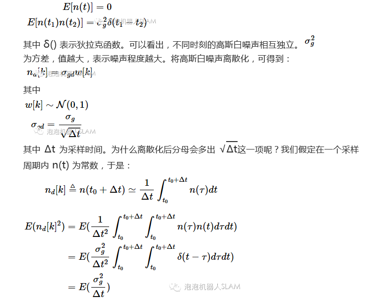

[TOC]

 # 一. 姿态的表示方法

## 3.旋转矢量

### 2.2.2 等效旋转矢量

参见图2.2-1，三维空间中的某矢量绕另一单位矢量转动（设）角度，得矢量，以下求解转动前后两矢量与之间的几何运算关系。

​                                                                           图2.2-1  等效旋转矢量

不妨假设矢量和单位矢量具有共同的起始点，记的矢端在上的投影为。若以为圆心、为半径作圆，则的矢端也在该圆周上。在圆上取一点使得，则有

转动前的矢量相对于单位矢量可分解为平行于的分量和垂直于的分量，如下

   即                          

其中

                                 

                            

同理，转动后的矢量相对于也可以分解为平行分量和垂直分量，如下

   即                    

其中

                                   （2.2-13）

               （2.2-14）

至此，将式（2.2-10）和式（2.2-14）代入式（2.2-12），可详细展开为

                    （2.2-15）

此外，由附录A三重矢积公式（A-3），即，可得

                （2.2-16）

将式（2.2-16）代入式（2.2-15），得

                  （2.2-17）

其中记

                       （2.2-18）

式（2.2-17）称为罗德里格（Rodrigues）旋转公式，它建立了转动前后两矢量与之间的线性变换关系，该变换是转轴及转角的函数。

直角坐标系上存在三个坐标轴向单位矢量，也可对它们实施旋转操作。假设有动坐标系系与参考坐标系系，两坐标系在起始时刻重合，接着系相对于系作定轴转动，即绕通过原点的单位矢量转动了角，也就是说，系坐标轴的单位矢量绕转动角得到系坐标轴的单位矢量。根据式（2.2-18），可得两坐标轴单位矢量之间的变换关系

                                  （2.2-19）

再假设

        （2.2-20）

将式（2.2-19）和（2.2-20）代入过渡矩阵式（2.2-2），得

             （2.2-21）

这表明，矩阵正好是从参考坐标系系到动坐标系系的过渡矩阵，它也是从系到系的坐标变换矩阵，可重新记式（2.2-18）为：

                      （2.2-22）

进一步，若记和，则有，将其代入式（2.2-22），可得

                       （2.2-23）

这里称为等效旋转矢量（Rotation Vector），根据图2.2-1，等效旋转矢量的矢量方向表示转轴方向，而模值大小表示旋转角度大小。从转动的物理含义上看，表示的是相同的转动，这可通过将其代入式（2.2-23）进行验证，即与的取值无关。如果限定转角的取值范围，则等效旋转矢量和方向余弦阵之间存在一一对应关系。从坐标系的定轴转动中可以看出，等效旋转矢量（或单位转轴）是一种比较特殊的矢量，它在系和系下的坐标值完全相等，即有（或）。有时为了更加明确地显示系相对于系的转动关系，可利用下角标进行标注，比如（或）。

将式（2.2-23）与向量反对称阵的矩阵函数（2.1-20）对比，可看出两者形式上完全一致，这说明式（2.1-20）中三维向量具有等效旋转矢量的物理含义。根据式（2.1-30）和（2.1-31）还可以看出，方向余弦阵的一个特征值恒为1（），与其对应的单位特征向量（）表示转轴方向；方向余弦阵的另外两个共轭特征值（和）即为等效旋转矢量模值的幂指函数，特征值的幅角表示等效旋转矢量的转角大小。

若将方向余弦阵看作是等效旋转矢量的函数，可简记为

                               （2.2-24）

并且有

                          （2.2-25）

特别地，若分别取、和，则有

  （2.2-26a）

  （2.2-26b）

   （2.2-26c）

上述三式分别称为以坐标轴为旋转轴的基本转动矩阵，或称Givens矩阵或初等旋转矩阵，空间的任意转动都可以由三次基本转动合成，参见附录B。

由等效旋转矢量与方向余弦阵之间的一一对应关系可知，方向余弦阵虽然含有9个元素，但它只有3个独立参数，包含了6个约束条件，即行向量之间两两正交（3个）及每个行向量模值均为1（3个）。3个独立参数即为3个自由度，这与三维空间中的转动自由度是一致的。

# 二. 观测量与噪声

### 2.1观测量

惯性导航系统包含惯性测量单元和导航处理器；

**惯性测量单元**就是通常所说的 **IMU**，主要包含加速度计和陀螺仪；加速度计测量的是相对于惯性空间，除了重力以外的所有加速度的矢量和（我们称之为比力）在三个加速度轴向的投影；陀螺仪测量的是相对于惯性空间的角速率或角增量在三个轴向的投影；

**导航处理器** 则利用加速度计和陀螺的数据进行导航算法的处理，从而提供位置速度和姿态信息

MEMS IMU  加速度计测量的是物体相对于惯性系的加速度在IMU坐标系的投影，用符号表示$a_{ib}^b$;陀螺仪测量的是物体相对于惯性系的加速度在IMU坐标系的投影，用符号表示为$\omega_{ib}^b$.但是IMU的输出受到器件噪声、零偏等各种因素的影响，将输出模型表示如下：
$$
\tilde{a}_{ib}^b(t)=a_{ib}^b(t)+b_a^b(t)+\eta_a^b(t)
$$

$$
\tilde{\omega}_{ib}^b(t)=\omega_{ib}^b(t)+b_{\omega}^b(t)+\eta_{\omega}^b(t)
$$

将器件输出的模型表示为：输出=真值+零偏+白噪声

### 2.2 随机噪声

#### 2.2-1高斯白噪声

在开始之前，先介绍以下高斯白噪声的性质。

高斯噪声是一种随机噪声，在任选瞬时中任取n个，其值按n个变数的高斯概率定律分布。由高斯概率定律分布可以知道，高斯噪声完全由其时变平均值和两瞬时的协方差来确定。若噪声为平稳的，则平均值与时间无关，而协方差函数则变成仅和所考虑的两瞬时之差有关的相关函数，它在意义上等效于功率谱密度。

白噪声是一种功率频谱密度为常数的随机信号或随机过程。换句话说，此信号在各个频段上的功率是一样的，由于白光是由各种频率（颜色）的单色光混合而成，因而此信号的这种具有平坦功率谱的性质被称作是“白色的”，此信号也因此被称作白噪声。相对的，其他不具有这一性质的噪声信号被称为有色噪声（功率谱密度随频率变化）。

理想的白噪声具有无限带宽，因而其能量是无限大，这在现实世界是不可能存在的。实际上，我们常常将有限带宽的平整讯号视为白噪音，因为这让我们在数学分析上更加方便。然而，白噪声在数学处理上比较方便，因此它是系统分析的有力工具。一般，只要一个噪声过程所具有的频谱宽度远远大于它所作用系统的带宽，并且在该带宽中其频谱密度基本上可以作为常数来考虑，就可以把它作为白噪声来处理。例如，热噪声和散弹噪声在很宽的频率范围内具有均匀的功率谱密度，通常可以认为它们是白噪声。白噪声的功率谱密度是一个常数。这是因为：白噪声的时域信号中任意两个不同时刻是不相关的，因此，白噪声的自相关函数为冲击函数，因此，白噪声的功率谱密度为常数。（自相关函数和功率谱密度是傅立叶变换对）。                     

高斯白噪声：如果一个噪声，它的幅度分布服从高斯分布，而它的功率谱密度又是均匀分布的，则称它为高斯白噪声。  

 热噪声和散粒噪声是高斯白噪声。  

 所谓高斯白噪声中的高斯是指概率分布是正态函数，而白噪声是指它的二阶矩不相关，一阶矩为常数，是指先后信号在时间上的相关性。这是考查一个信号的两个不同方面的问题。时变信号，顾名思义，就是信号的幅度随时间变化的信号，幅度不随时间变化的信号，即幅度保持为常数的信号叫时不变信号。高斯白噪声是指信号中包含从负无穷到正无穷之间的所有频率分量，且各频率分量在信号中的权值相同。白光包含各个频率成分的光，白噪声这个名称是由此由此而来的。它在任意时刻的幅度是随机的，但在整体上满足高斯分布函数。

（1）带通噪声。带通噪声与白噪声相对又叫有色噪声，即在某个频带上信号的能量突然变大。这种噪声的典型例子为交流电噪声，它的能量主要集中在50Hz左右。对这种噪声的滤除可以先对语音信号进行加窗，然后再进行短时傅立叶变换并画出频谱图。在频谱图上，我们可以看出该噪声的能量主要集中在哪个频带上，得到此频带的上下限。根据此频带的上下限设计一个滤波器对语音信号进行滤波。一般情况下，该方法可以比较有效的去除带通噪声。     （2）冲击噪声。所谓冲击噪声就是语音信号中的能量在时域内突然变大。这种噪声也很多，例如建筑工地上打桩机发出的打桩声，在语音信号中每隔一段时间就会出现一个能量峰值。对于这种噪声的消除需要对语音信号进行加窗，再进行短时傅立叶变换画出频谱图。在频谱图上对相应时间段上的语音信号的能量进行修改，即降低噪声的能量。该降噪方法一般能取得较满意的效果。 

（3）白色噪声。所谓白色噪声就是在频域上不存在信号能量的突然变大的频带，在时域上也找不到信号能量突然变大的时间段，即它在频域和时域上的分布是一致的  。对于标准白噪声它的均值为零，方差为一常数。对于被这种噪声污染的语音信号，既不能在某个频带上修改语音信号又不能在时域上某个时刻修改语音信号。使用上两种降噪方法都很难达到令人满意的效果。主要原因是：白噪声的频带很宽几乎占据了整个频域，它与语音信号重叠无法区分有用信号和噪声；语音信号中的清音与白噪声的性质差不多很难区分等。

 当随机的从高斯分布中获取采样值时，采样点所组成的随机过程就是“高斯白噪声”；同理，当随机的从均匀分布中获取采样值时，采样点所组成的随机过程就是“均匀白噪声”。那么，是否有“非白的高斯”噪声呢？答案是肯定的，这就是”高斯色噪声“。这种噪声其分布是高斯的，但是它的频谱不是一个常数，或者说，对高斯信号采样的时候不是随机采样的，而是按照某种规律来采样的。相关讨论： 
1、白噪声是指功率谱在整个频域内为常数的噪声，其付氏反变换是单位冲击函数的n倍（n取决于功率谱的大小），说明噪声自相关函数在t=0时不为零，其他时刻都为0，自相关性最强。 高斯噪声是一种随机噪声，其幅度的统计规律服从高斯分布。 高斯白噪声是幅度统计规律服从高斯分布而功率谱为常数的噪声。如果在系统通带内功率谱为常数，成为带限白噪声“高斯”与“白”没有直接关系，有时人们还会提出高斯型噪声，这指的是噪声功率谱呈高斯分布函数的形状而已。

2、有一个问题我想提出来： 
   连续白噪声和离散白噪声序列的关系是什么？它们之间不应该是简单的采样关系。因为连续白噪声的功率谱在整个频率轴上为常数，按照随机信号采样定理，对这样的信号采样，采样后的序列的功率谱必然发生混叠，而且混叠过后的功率谱是什么？应该是在整个频率轴上都为无穷大。这显然不满足离散白噪声序列的定义。 
   那离散白噪声序列跟连续白噪声有何关系？我觉得是对带限的连续白噪声进行采样后得到的，这个带限的连续白噪声信号的带宽刚好满足Nyquist抽样定理。这样采样过后的信号的功率谱就能满足定义了。 
 答：连续白噪声是离散白噪声在采样间隔趋近于零的极限。对带限的连续白噪声按照Nyquist采样定理进行采样就得到信息不损失的白噪声序列，当连续白噪声的带宽趋近于无穷大时，采样率也趋近于无穷大（采样间隔趋近于零），此时不会发生频谱混叠。用极限的概念理解二者的关系就很清楚了。需要说明的是，任何实际系统都是工作于一定频带范围内的，带宽为无穷大的信号仅仅存在于理论分析中，在实际系统中找不到。而对于限带白噪声，我认为既然考虑采样定理，那么连续的限带白噪声可以利用采样函数作为正交基的系数来表示，这些系数就是对应的噪声采样值，这个过程就是连续噪声的离散化过程，以上分析也是分析连续信道容量使用的方法。那么在数字通信中我们讨论的噪声实际就是这些离散的以采样函数为正交基的系数（即噪声采样值），这时分析这些噪声采样值可知相关函数就是 N0×delta(n)，这里delta(n)是离散的冲激函数。也即功率为N0×delta(0)＝N0为有限值。<u>以上分析具体可以参考John Proakis的一书。</u>

 另外，还必须区分高斯噪声和白噪声两个不同的概念。高斯噪声是指噪声的概率密度函数服从高斯分布，白噪声是指噪声的任意两个采样样本之间不相关，两者描述的角度不同。白噪声不必服从高斯分布，高斯分布的噪声不一定是白噪声。当然，实际系统中的热噪声是我们一般所说的白噪声的主要来源，它是服从高斯分布的，但一般具有有限的带宽，即常说的窄带白噪声，严格意义上它不是白噪声。信号中高斯白噪声在频域中是否仍为高斯白噪声？谢谢。  严格来说，你这种提问的方法是有问题的，因为白噪声从定义上说就是指随机序列在时间上不相关。问题应该这样问：高斯白噪声序列变换到频域后是否仍然不相关？由于傅立叶变换是一种线性变换，高斯白噪声序列变换到频域后肯定服从高斯分布，而且仍然不相关。因为对一个满秩矩阵进行正交变换（傅立叶变换是一种正交变换）得到的矩阵仍然是满秩矩阵。 

AWGN：加性高斯白噪声 （Additive White Gaussian Noise）是指: 加性高斯白噪声（AWGN）从统计上而言是随机无线噪声，其特点是其通信信道上的信号分布在很宽的频带范围内。

***需要补充的是连续带限白噪声的离散化理论***

#### 2.2-2 随机噪声

参考[《Indirect Kalman Filter for 3D Attitude Estimation》](http://mars.cs.umn.edu/tr/reports/Trawny05b.pd)和[Kalibr-IMU noise Modle](https://github.com/ethz-asl/kalibr/wiki/IMU-Noise-Model)
$$
\tilde{\omega}_{ib}^b=\omega+b+n_r
$$
在这个公式中，$b$代表的是常值零偏，$n_r$代表的是噪声，在这里可以假设是高斯白噪声，而高斯白噪声满足如下两个条件：
$$
E[n_r]=0_{3×1}
$$

$$
E[n_r(t+\tau)n_r^T(t)]=N_r\delta(\tau)
$$

如果是离散的情况下,有如下的关系式：
$$
n_d[k] =\sqrt{N_{rd}}*w[k]
$$
其中$w[k]满足均值为零，方差为1的高斯分布即：$$w[k]\sim N(0,1)$

同时：$N_{rd}=N_r/t$ ，t为采样间隔。

如果假设$N_r=\sigma_c^2$和$N_{rd}=\sigma_d^2$则：
$$
\sigma_d =\sigma_c/\sqrt{\Delta t}
$$
 公式由如下推导：

 

个人理解：通常我们使用ALLAN方差解算得到IMU的ARW或VRW，由ARW我们便可以计算方差：$\sigma^2 =arw *f_s$  目前的理解是这样。

# 四 预积分理论总结

预积分的推导 

1.1 离散状态下预积分方程:

(1) [VINS-Mono: A Robust and Versatile Monocular Visual-Inertial State Estimator, Tong Qin, Peiliang Li, Zhenfei Yang, Shaojie Shen (techincal report)](https://github.com/HKUST-Aerial-Robotics/VINS-Mono/blob/master/support_files/paper/tro_technical_report.pdf)

(2) [Solà J. Quaternion kinematics for the error-state KF[\]// Surface and Interface Analysis. 2015.](http://www.iri.upc.edu/people/jsola/JoanSola/objectes/notes/kinematics.pdf)

关于这部分的论文和代码中的推导，可以参考文献[2]中Appendx部分“A Runge-Kutta numerical integration methods”中的欧拉法和中值法。

$$w_{k}^{{}'}=\frac{w_{k+1}+w_{k}}{2}-b_{w}$$

$q _{i+1}=q _{i}\otimes \begin{bmatrix}1\\0.5w_{k}^{{}'}\delta t\end{bmatrix}$

$a_{k}^{{}'}=\frac{q_{k}(a_{k}+n_{a0}-b_{a_{k}})+q_{k+1}(a_{k+1}++n_{a1}-b_{a_{k}})}{2}$
$\alpha _{i+1}=\delta\alpha _{i}+\beta _{i}t+0.5a_{k}^{{}'}\delta t^{2}$
$\beta _{i+1}=\delta\beta _{i}+a_{k}^{{}'}\delta t$
1.2 离散状态下误差状态方程

论文中Ⅱ.B部分的误差状态方程是连续时间域内，在实际代码中需要的是离散时间下的方程式，而且在前面的预积分方程中使用了中值法积分方式。所以在实际代码中和论文是不一致的。在推导误差状态方程式的最重要的部分是对$\delta \theta _{k+1}$ 部分的推导。

由泰勒公式可得：
$\delta \theta _{k+1} = \delta \theta _{k}+\dot{\delta \theta _{k}}\delta t(2.1)$
依据参考文献[2]中 "5.3.3 The error-state kinematics"中公式(222c)及其推导过程有：
$\dot{\delta \theta _{k}}=-[w_{m}-w_{b}]_{\times }\delta \theta _{k}-\delta w_{b}-w_{n}$
对于中值法积分下的误差状态方程为：
$\dot{\delta \theta _{k}}=-[\frac{w_{k+1}+w_{k}}{2}-b_{g_{k}}]_{\times }\delta \theta _{k}-\delta b_{g_{k}}+\frac{n_{w0}+n_{w1}}{2}(2.2)$
将式(2.2)带入式(2.1)可得：

$\delta \theta _{k+1} =(I-[\frac{w_{k+1}+w_{k}}{2}-b_{g_{k}}]_{\times }\delta t) \delta \theta _{k} -\delta b_{g_{k}}\delta t+\frac{n_{w0}+n_{w1}}{2}\delta t$
这部分也可以参考，文献[2]中“7.2 System kinematics in discrete time”小节。
  接下来先推导 $\delta \beta _{k+1}$ 部分，再推导$\delta \alpha _{k+1}$部分。$\delta \beta _{k+1}$部分的推导也可以参考文献[2]中“5.3.3 The error-state kinematics”公式(222b)的推导。将式(1.5)展开得到：
$\delta\beta _{i+1}=\delta\beta _{i}+\frac{q_{k}(a_{k}+n_{a0}-b_{a_{k}})+q_{k+1}(a_{k+1}++n_{a1}-b_{a_{k}})}{2}\delta t$
即，
$\delta\beta _{i+1}=\delta\beta _{i}+\dot{\delta\beta_{i}}\delta t$
文献[2]中
$\dot{\delta v}=-R[a_{m}-a_{b}]_{\times}\delta \theta-R\delta a_{b}+\delta g-Ra_{n}$
对于中值法积分下的误差状态方程为

$\begin{align} \notag \dot{\delta\beta_{i}} =&-\frac{1}{2}q_{k}[a_{k}-b_{a_{k}}]_{\times}\delta \theta-\frac{1}{2}q_{k+1}[a_{k+1}-b_{a_{k}}]_{\times}\delta \theta _{k+1} -\delta b_{g_{k}}\delta t+\frac{n_{w0}+n_{w1}}{2}\delta t)\delta \theta \\\notag  &-\frac{1}{2}q_{k}\delta b_{a_{k}}-\frac{1}{2}q_{k+1}\delta b_{a_{k}}-\frac{1}{2}q_{k}n_{a0}-\frac{1}{2}q_{k}n_{a1} \end{align} $

将式(2.3)带入式(2.5)可得

$\begin{align}\notag\dot{\delta\beta_{i}} =&-\frac{1}{2}q_{k}[a_{k}-b_{a_{k}}]_{\times}\delta \theta-\frac{1}{2}q_{k+1}[a_{k+1}-b_{a_{k}}]_{\times}((I-[\frac{w_{k+1}+w_{k}}{2}-b_{g_{k}}]_{\times }\delta t) \delta \theta _{k} \delta b_{g_{k}}\delta t\\\notag&+\frac{n_{w0}+n_{w1}}{2}\delta t)  -\frac{1}{2}q_{k}\delta b_{a_{k}}-\frac{1}{2}q_{k+1}\delta b_{a_{k}}-\frac{1}{2}q_{k}n_{a0}-\frac{1}{2}q_{k}n_{a1}\end{align}$

同理，可以计算出$\delta \alpha _{k+1}$ ，可以写为：
$\delta\alpha _{i+1}=\delta\alpha _{i}+\dot{\delta\alpha_{i}}\delta t\tag{2.7}$

$\begin{align}\notag\dot{\delta\alpha_{i}} =&-\frac{1}{4}q_{k}[a_{k}-b_{a_{k}}]_{\times}\delta \theta\delta t-\frac{1}{4}q_{k+1}[a_{k+1}-b_{a_{k}}]_{\times}((I-[\frac{w_{k+1}+w_{k}}{2}-b_{g_{k}}]_{\times }\delta t) \delta \theta _{k} -\delta b_{g_{k}}\delta t \\\notag&+\frac{n_{w0}+n_{w1}}{2}\delta t)\delta t -\frac{1}{4}q_{k}\delta b_{a_{k}}\delta t-\frac{1}{4}q_{k+1}\delta b_{a_{k}}\delta t-\frac{1}{4}q_{k}n_{a0}\delta t-\frac{1}{4}q_{k}n_{a1}\delta t\end{align}$

最后是加速度计和陀螺仪bias的误差状态方程，
$\delta b_{a_{k+1}}=\delta b_{a_{k}}+n_{ba}\delta t$

$$\delta b_{w_{k+1}}=\delta b_{w_{k}}+n_{bg}\delta t$$

综合式(2.3)等误差状态方程，将其写为矩阵形式，

$\begin{align}\notag\begin{bmatrix}\delta \alpha_{k+1}\\\delta \theta  _{k+1}\\\delta \beta _{k+1} \\\delta b _{a{}{k+1}} \\\delta b _{g{}{k+1}}\end{bmatrix}&=\begin{bmatrix}I & f_{01} &\delta t  & -\frac{1}{4}(q_{k}+q_{k+1})\delta t^{2} & f_{04}\\0 & I-[\frac{w_{k+1}+w_{k}}{2}-b_{wk}]_{\times }\delta t & 0 &  0&-\delta t \\0 &  f_{21}&I  &  -\frac{1}{2}(q_{k}+q_{k+1})\delta t & f_{24}\\0 &  0&  0&I  &0 \\ 0& 0 & 0 & 0 & I\end{bmatrix}\begin{bmatrix}\delta \alpha_{k}\\\delta \theta  _{k}\\\delta \beta _{k} \\\delta b _{a{}{k}} \\\delta b _{g{}{k}}\end{bmatrix} \\\notag&+\begin{bmatrix} \frac{1}{4}q_{k}\delta t^{2}&  v_{01}& \frac{1}{4}q_{k+1}\delta t^{2} & v_{03} & 0 & 0\\0& \frac{1}{2}\delta t & 0 & \frac{1}{2}\delta t &0  & 0\\\frac{1}{2}q_{k}\delta t&  v_{21}& \frac{1}{2}q_{k+1}\delta t & v_{23} & 0 & 0 \\0 & 0 & 0 & 0 &\delta t  &0 \\0& 0 &0  & 0 &0  & \delta t\end{bmatrix}\begin{bmatrix}n_{a0}\\n_{w0}\\n_{a1}\\n_{w1}\\n_{ba}\\n_{bg}\end{bmatrix}\end{align}$

其中，

$\begin{align}\notag f_{01}&=-\frac{1}{4}q_{k}[a_{k}-b_{a_{k}}]_{\times}\delta t^{2}-\frac{1}{4}q_{k+1}[a_{k+1}b_{a_{k}}]_{\times}(I-[\frac{w_{k+1}+w_{k}}{2}-b_{g_{k}}]_{\times }\delta t)\delta t^{2} \\\notag f_{21}&=-\frac{1}{2}q_{k}[a_{k}-b_{a_{k}}]_{\times}\delta t-\frac{1}{2}q_{k+1}[a_{k+1}-b_{a_{k}}]_{\times}(I-[\frac{w_{k+1}+w_{k}}{2}-b_{g_{k}}]_{\times }\delta t)\delta t \\\notag f_{04}&=\frac{1}{4}(-q_{k+1}[a_{k+1}-b_{a_{k}}]_{\times}\delta t^{2})(-\delta t) \\\notag f_{24}&=\frac{1}{2}(-q_{k+1}[a_{k+1}-b_{a_{k}}]_{\times}\delta t)(-\delta t) \\\notag v_{01}&=\frac{1}{4}(-q_{k+1}[a_{k+1}-b_{a_{k}}]_{\times}\delta t^{2})\frac{1}{2}\delta t \\\notag v_{03}&=\frac{1}{4}(-q_{k+1}[a_{k+1}-b_{a_{k}}]_{\times}\delta t^{2})\frac{1}{2}\delta t \\\notag v_{21}&=\frac{1}{2}(-q_{k+1}[a_{k+1}-b_{a_{k}}]_{\times}\delta t^{2})\frac{1}{2}\delta t \\\notag v_{23}&=\frac{1}{2}(-q_{k+1}[a_{k+1}-b_{a_{k}}]_{\times}\delta t^{2})\frac{1}{2}\delta t\end{align}$
将式(2.11)简写为，

$\delta z_{k+1} = F\delta z_{k}+VQ$

最后得到系统的雅克比矩阵$J_{k+1}$ 和协方差矩阵 $P_{k+1}$，初始状态下的雅克比矩阵和协方差矩阵为单位阵和零矩阵，即
$\notag J_{k}=I \\\notag  P_{k}=0$

$J_{k+1}=FJ_{k}$

$P_{k+1}=FP_{k}F^{T}+VQV_{T}$

